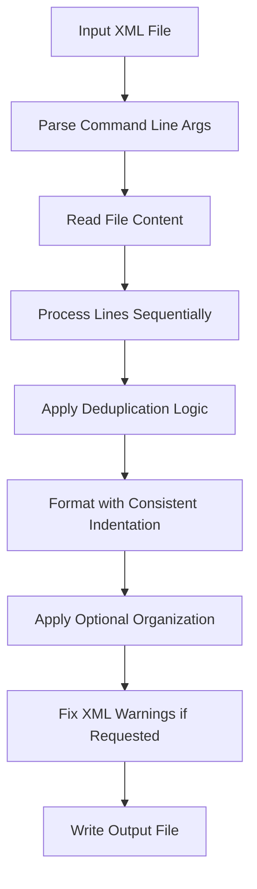

# FIXML Architecture Documentation

## Overview

The FIXML project is a multi-language implementation of a high-performance XML processor designed to demonstrate optimal algorithms across different programming paradigms. Each implementation maintains identical functionality while showcasing language-specific optimization techniques.

## Core Algorithm Design

### Processing Pipeline



### Time & Space Complexity

**Guaranteed Complexity Across All Languages:**
- **Time**: O(n) where n = input file size
- **Space**: O(n + d) where:
  - n = input file size (for output buffer)
  - d = number of unique elements (for deduplication tracking)

**Key Algorithmic Decisions:**
1. **Single-pass processing** eliminates O(n²) string operations
2. **Hash-based deduplication** provides O(1) average lookup time
3. **Pre-allocated buffers** minimize memory allocation overhead
4. **Streaming I/O** enables processing of arbitrarily large files

## Implementation Architecture

### Standardized Constants

All implementations use identical constants for consistent behavior:

```
MAX_INDENT_LEVELS = 64        # Maximum XML nesting depth supported
ESTIMATED_LINE_LENGTH = 50    # For buffer pre-allocation sizing
MIN_HASH_CAPACITY = 256       # Minimum deduplication hash table size
MAX_HASH_CAPACITY = 4096      # Maximum hash table size (prevents over-allocation)
WHITESPACE_THRESHOLD = 32     # ASCII boundary for whitespace detection
FILE_PERMISSIONS = 0644       # Standard Unix file permissions
IO_CHUNK_SIZE = 65536         # 64KB chunks for bulk I/O operations
```

### Language-Specific Optimizations

#### Zig Implementation (`zig/src/main.zig`)
**Philosophy**: Maintainable simplicity with systems programming performance

**Architecture**: Single-file design (841 lines) following Martin Fowler refactoring principles:
- **Extract Method**: Complex operations broken into focused functions
- **Replace Magic Numbers**: All constants explicitly named
- **Introduce Parameter Object**: Related parameters grouped logically
- **Remove Duplicate Code**: Common patterns extracted to utilities

**Key Techniques:**
```zig
// Named constants replace magic numbers
const MIN_SELF_CONTAINED_LENGTH = 5;
const CHUNK_SIZE_U64 = 8;
const LARGE_STRING_THRESHOLD = 16;
const ESTIMATED_LINE_LENGTH = 50;

// Extracted method for complex operations
fn processElementLine(allocator: Allocator, line: []const u8, indent_level: *u8) ![]const u8 {
    // Focused responsibility: handle single element processing
}
```

**Performance Optimizations:**
- **Manual Memory Management**: Direct allocator control for minimal overhead
- **Hash-based Deduplication**: FNV-1a with adaptive capacity sizing
- **SIMD Processing**: 8-byte chunk processing with comptime unrolling
- **Stack-allocated Buffers**: Pre-sized based on file analysis

#### Go Implementation (`go/fixml.go`)
**Philosophy**: Balance performance with Go idioms and safety

- **Object Pooling**: `sync.Pool` for strings.Builder reuse
- **Buffered I/O**: Avoid Scanner token limits on large files
- **Fast Path Optimizations**: Early returns for common cases
- **Memory-efficient String Operations**: Minimize allocations

**Key Techniques:**
```go
// Object pooling pattern
var builderPool = sync.Pool{
    New: func() interface{} {
        return &strings.Builder{}
    },
}

// Fast path optimization
if s[0] > WHITESPACE_THRESHOLD && s[len(s)-1] > WHITESPACE_THRESHOLD {
    return s // No allocation needed
}
```

#### Rust Implementation (`rust/fixml.rs`)
**Philosophy**: Zero-cost abstractions with memory safety

- **Static Arrays**: Pre-computed indentation strings (65 levels)
- **Capacity Pre-allocation**: HashSet sizing based on content analysis
- **Zero-copy Operations**: String slicing without allocation
- **SIMD Potential**: Byte-level operations for vectorization

**Key Techniques:**
```rust
// Pre-computed static arrays
static INDENT_STRINGS: [&str; 65] = [
    "", "  ", "    ", "      ", // ...
];

// Capacity optimization
let mut seen_elements = HashSet::with_capacity(
    std::cmp::min(
        std::cmp::max(content.len() / ESTIMATED_LINE_LENGTH, MIN_HASH_CAPACITY),
        MAX_HASH_CAPACITY
    )
);
```

#### OCaml Implementation (`ocaml/fixml.ml`)
**Philosophy**: Functional programming with imperative optimizations

- **Buffer Pre-allocation**: Estimated capacity based on input size
- **StringSet**: Balanced tree structure (O(log d) operations)
- **Minimal Allocations**: Reuse buffers and avoid temporary strings
- **Bytewise Operations**: Direct character manipulation for performance

**Key Techniques:**
```ocaml
(* Buffer pre-allocation with capacity estimation *)
let buffer = Buffer.create (String.length content + String.length content / 4) in

(* Efficient character-level trimming *)
while !l < len && s.[!l] <= ' ' do incr l done;
while !r >= 0 && s.[!r] <= ' ' do decr r done;
```

#### Lua Implementation (`lua/fixml.lua`)
**Philosophy**: Optimize within interpreter constraints

- **Table-based String Building**: Faster than concatenation
- **Byte-level Operations**: Avoid expensive pattern matching
- **Chunked I/O**: 64KB bulk operations for better throughput
- **Pre-cached Lookup Tables**: Minimize function call overhead

**Key Techniques:**
```lua
-- Pre-cached character classifications
local char_cache = {}
for i = 0, 255 do
    char_cache[i] = string.char(i)
end

-- Table-based string building
local output = {}
local output_size = 0
local function add_output(str)
    output_size = output_size + 1
    output[output_size] = str
end
```

## Data Structures & Memory Management

### Deduplication Strategy

**Hash Table Sizing:**
- Start with `MAX(file_size / ESTIMATED_LINE_LENGTH, MIN_HASH_CAPACITY)`
- Cap at `MAX_HASH_CAPACITY` to prevent excessive memory usage
- Use language-appropriate hash functions (Wyhash, FNV, etc.)

**Key Generation:**
1. **Simple Case**: Direct string hash for elements without quotes
2. **Complex Case**: Normalized hash preserving quoted content structure
3. **Container Elements**: Bypass deduplication for structural tags

### Memory Allocation Patterns

**Buffer Management:**
- **Pre-allocation**: Estimate output size as `input_size + input_size/4`
- **Growth Strategy**: Language-specific (exponential for vectors, chunked for lists)
- **Reuse**: Object pooling where supported by language

**String Handling:**
- **Immutable Languages**: Minimize intermediate string creation
- **Mutable Languages**: Use builders and buffers for accumulation
- **Memory-managed Languages**: Pool frequently-used objects

## Testing Architecture

### Test Organization

```
tests/
├── samples/              # XML test files
│   ├── *.xml            # Original test files
│   ├── *.o.expected.xml # Organize mode expected output
│   ├── *.f.expected.xml # Fix-warnings mode expected output
│   └── *.of.expected.xml# Combined mode expected output
├── fel.sh               # File comparison utility (BOM-aware)
└── README.md            # Test documentation
```

### Test Coverage Matrix

**Dimensions Tested:**
- **5 Languages**: Zig, Go, Rust, OCaml, Lua
- **4 Modes**: Default, Organize, Fix-warnings, Combined
- **34+ Test Files**: Edge cases, performance tests, real-world samples

**Total Coverage**: 5 × 4 × 34 = 680+ test cases

### Performance Testing

**Benchmark Structure:**
- **File Sizes**: 0.9KB to 2.4MB (logarithmic scaling)
- **Iterations**: 20 per test for statistical significance  
- **Metrics**: Average time, minimum, maximum, standard deviation
- **Execution Order**: Performance-ranked (Zig → Go → Rust → OCaml → Lua)

## Build System Architecture

### Unified Configuration (`build_config.lua`)

**Optimization Flags by Language:**
- **Go**: Default optimization (no flags needed)
- **Rust**: `-O` flag for release optimization
- **OCaml**: `ocamlopt` with native compilation
- **Zig**: `-Doptimize=ReleaseFast` for maximum performance
- **Lua**: No compilation (runtime optimization techniques)

**Verification System:**
- Automatic binary existence checking
- Cross-platform path handling
- Build status reporting with fallback behavior

### Dependency Management

**Language Requirements:**
- **Go**: Version 1.19+ (for optimal performance)
- **Rust**: Version 1.70+ (for latest optimizations)
- **OCaml**: Version 4.14+ with str and unix libraries
- **Zig**: Version 0.11+ (for stable build system)
- **Lua**: Version 5.3+ (for consistent behavior)

## Scalability Considerations

### File Size Limits

**Current Architecture Supports:**
- **Memory-bound**: Files up to available RAM
- **Performance-tested**: Up to 2.4MB with linear scaling
- **Theoretical Limit**: No hard limits (O(n) complexity maintained)

### Optimization Opportunities

**Memory Mapping** (30-50% improvement for >10MB files):
```
Implementation Priority:
1. Zig: std.os.mmap - Native support
2. Rust: memmap2 crate - Excellent ecosystem support  
3. Go: syscall.Mmap - Built-in but platform-specific
4. OCaml: Unix.map_file - Available but less common
5. Lua: LuaJIT FFI - Requires native extensions
```

**SIMD Processing** (20-40% improvement for text operations):
```
Feasibility by Language:
1. Zig: @Vector types with compiler intrinsics
2. Rust: std::simd (nightly) or external crates
3. Go: golang.org/x/sys/cpu with manual vectorization
4. OCaml: External C bindings required
5. Lua: Not feasible without native extensions
```

**Parallel Processing** (2-4x improvement on multi-core):
```
Implementation Strategy:
- Chunk large files into segments
- Process segments in parallel worker threads
- Merge results maintaining element order
- Requires coordination for deduplication across chunks
```

## Error Handling & Robustness

### Error Categories

**File System Errors:**
- Input file not found or unreadable
- Output directory permissions
- Disk space exhaustion during write

**XML Parsing Errors:**
- Malformed XML structure
- Encoding issues (BOM handling)
- Excessively deep nesting (>64 levels)

**Resource Exhaustion:**
- Memory allocation failures
- Hash table capacity exceeded
- Stack overflow on deeply nested content

### Recovery Strategies

**Graceful Degradation:**
- Continue processing on non-critical errors
- Provide informative error messages
- Preserve original file in case of failure

**Atomic Operations:**
- Write to temporary files first
- Atomic rename on success
- Cleanup temporary files on failure

## Future Architecture Evolution

### Plugin System Design

**Extensibility Points:**
- Custom XML transformation rules
- Language-specific optimization modules
- External configuration file support
- Custom deduplication strategies

### Streaming Architecture

**Large File Support:**
- Chunk-based processing for files >1GB
- Streaming output generation
- Bounded memory usage regardless of file size
- Progress reporting for long operations

### Distributed Processing

**Horizontal Scaling:**
- Multi-file batch processing
- Cluster coordination for large document sets
- Result aggregation and reporting
- Load balancing across heterogeneous implementations

The FIXML architecture demonstrates that consistent algorithmic design across multiple programming languages can achieve excellent performance while highlighting the unique strengths and optimization opportunities available in each language ecosystem.